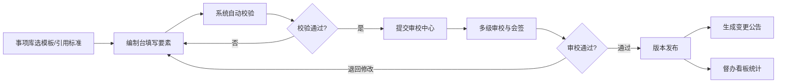

## 1. 产品概述

政务服务事项实施清单管理平台，面向省、市、县三级政务服务管理机构和部门事项管理员，提供统一编制、审校和发布政务服务事项实施清单的全流程闭环管理。平台解决多层级口径不一、重复填报、审核意见分散等痛点，支撑日常集中编制和年度专项梳理场景。

## 2. 核心功能

### 2.1 用户角色

| 角色 | 注册方式 | 核心权限 |
|------|----------|----------|
| 省级管理员 | 系统分配 | 模板维护、标准引用、全省清单审校、发布督办 |
| 市级管理员 | 系统分配 | 市级清单编制、审校下属区县、会签流转 |
| 县级管理员 | 系统分配 | 县级清单编制、事项要素填写、提交审校 |
| 部门事项管理员 | 系统分配 | 本部门事项编制、材料维护、流程配置 |

### 2.2 功能模块

1. **事项库**：事项模板维护、国家/省级标准引用、事项分类管理、历史版本回溯
2. **编制台**：情形化要素填写、申请材料颗粒度拆分、受理条件配置、办理流程编排
3. **审校中心**：清单审校、跨部门会签流转、退回修改留痕、审校意见管理
4. **版本发布**：正式发布、变更公告、版本对比、上下级清单继承与差异标注
5. **督办看板**：编制进度统计、同层级同事项横向比对、时限对比提醒、异常预警
6. **知识规则**：常见错误规则提示、编制规范知识库、校验规则配置

### 2.3 页面详情

| 页面名称 | 模块名称 | 功能描述 |
|---------|---------|----------|
| 事项库首页 | 事项库 | 事项分类树、事项列表、搜索筛选、模板管理入口 |
| 事项详情页 | 事项库 | 事项基本信息、版本历史、标准引用、要素概览 |
| 编制工作台 | 编制台 | 待编事项列表、编制进度、快捷操作入口 |
| 事项编制页 | 编制台 | 情形化要素表单、材料拆分、受理条件、流程联动校验 |
| 审校工作台 | 审校中心 | 待审校清单、审校任务池、会签流转状态 |
| 审校详情页 | 审校中心 | 清单内容预览、审校意见录入、退回归档、通过发布 |
| 版本管理页 | 版本发布 | 发布历史、版本对比、变更记录、公告管理 |
| 督办概览 | 督办看板 | 全省/市/县编制进度统计、时限对比、横向比对图表 |
| 规则库 | 知识规则 | 校验规则列表、常见错误提示、编制规范文档 |

## 3. 核心流程

事项从创建到发布的全流程：事项管理员在事项库选择模板或引用标准 → 进入编制台填写情形化要素、拆分材料、配置流程 → 系统自动校验（受理条件与流程联动、时限对比等）→ 提交审校中心 → 多级审校与跨部门会签 → 退回修改留痕或审校通过 → 版本发布并生成变更公告 → 督办看板实时统计进度。

## 4. 用户界面设计

### 4.1 设计风格

- **主色调**：政务蓝 `#1d4ed8` 作为主色，搭配深灰 `#1e293b` 作为功能色，体现庄重、专业的政务风格
- **辅助色**：成功绿 `#059669`、警告橙 `#d97706`、错误红 `#dc2626`，用于状态标识
- **按钮样式**：直角微圆角（4px）、实心主按钮配细线描边、悬停有轻微阴影下沉
- **字体**：中文使用 "PingFang SC" / "Microsoft YaHei"，数字和英文使用 "Roboto Mono"，标题字重 600，正文字重 400
- **布局风格**：左侧导航 + 顶部面包屑 + 主内容区三栏布局，卡片式内容容器，清晰的分割线
- **图标风格**：线性简洁图标（lucide-react），图标与文字间距 8px
- **整体调性**：专业、稳重、高效，信息密度适中，数据表格为核心展示形式

### 4.2 页面设计概览

| 页面名称 | 模块名称 | UI 元素 |
|---------|---------|---------|
| 事项库首页 | 事项库 | 左侧分类树、顶部搜索栏、事项列表表格、状态标签、操作按钮组 |
| 编制工作台 | 编制台 | 顶部统计卡片、待编事项列表、进度条、快捷操作入口 |
| 事项编制页 | 编制台 | 左侧步骤导航、中间表单区、右侧校验提示面板、底部操作栏 |
| 审校工作台 | 审校中心 | 待办卡片、任务列表、会签流转图、状态时间线 |
| 版本管理页 | 版本发布 | 版本时间轴、版本对比视图、变更公告列表 |
| 督办概览 | 督办看板 | 统计指标卡、进度环形图、横向对比柱状图、预警列表 |
| 规则库 | 知识规则 | 规则分类标签、规则卡片、错误示例与正确示例对比 |

### 4.3 响应式

- **桌面优先**：以 1440px 宽度为基准设计，支持 1280px-1920px 自适应
- **侧边栏**：可折叠收起，收起后仅显示图标
- **表格**：小屏幕下支持横向滚动，关键列固定
- **触控优化**：按钮最小高度 36px，确保触屏可点

### 4.4 动效与交互

- 页面切换：淡入淡出过渡（200ms）
- 表格行：hover 时背景色轻微加深
- 表单校验：错误信息红色波浪下划线 + 提示气泡
- 进度更新：数字滚动动画
- 侧边栏折叠：平滑滑入滑出（300ms ease）
