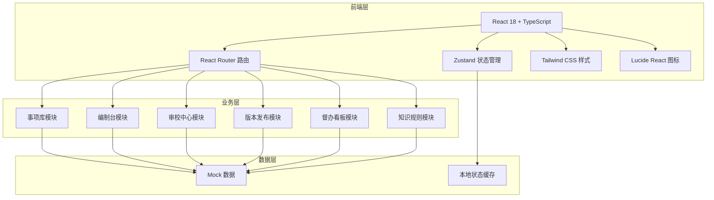
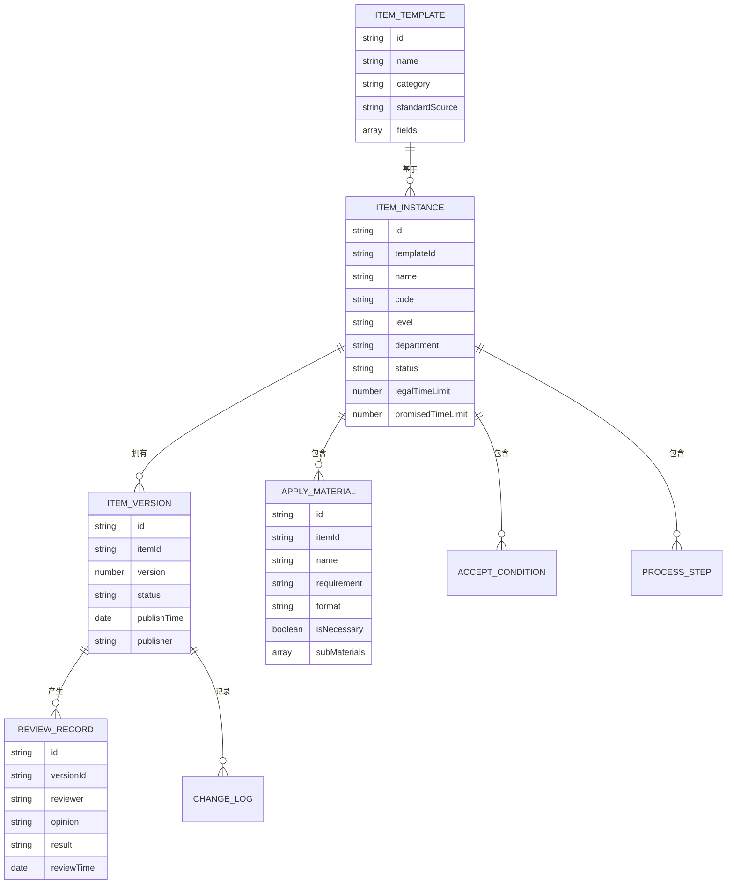

## 1. 架构设计



## 2. 技术描述

- **前端框架**：React 18 + TypeScript
- **构建工具**：Vite 5
- **路由管理**：React Router DOM 6
- **状态管理**：Zustand 4
- **样式方案**：Tailwind CSS 3
- **图标库**：Lucide React
- **后端**：无后端，纯前端 Mock 数据
- **数据方案**：本地 JSON Mock 数据 + Zustand 状态管理

## 3. 路由定义

| 路由 | 页面用途 |
|------|---------|
| `/` | 督办概览（首页） |
| `/item-library` | 事项库首页 |
| `/item-library/:id` | 事项详情页 |
| `/compilation` | 编制工作台 |
| `/compilation/:id` | 事项编制页 |
| `/review` | 审校工作台 |
| `/review/:id` | 审校详情页 |
| `/version` | 版本管理页 |
| `/dashboard` | 督办看板 |
| `/knowledge` | 知识规则库 |

## 4. 数据模型

### 4.1 核心数据模型



### 4.2 核心类型定义

```typescript
// 事项基础信息
interface ServiceItem {
  id: string;
  name: string;
  code: string;
  category: string;
  level: 'provincial' | 'municipal' | 'county';
  department: string;
  status: 'draft' | 'compiling' | 'reviewing' | 'rejected' | 'published';
  legalTimeLimit: number;
  promisedTimeLimit: number;
  templateId?: string;
  standardSource?: string;
  createdAt: string;
  updatedAt: string;
}

// 申请材料
interface ApplyMaterial {
  id: string;
  name: string;
  requirement: string;
  format: 'original' | 'copy' | 'electronic';
  isNecessary: boolean;
  quantity: number;
  subMaterials?: ApplyMaterial[];
}

// 受理条件
interface AcceptCondition {
  id: string;
  content: string;
  scene: string;
}

// 办理流程
interface ProcessStep {
  id: string;
  stepNo: number;
  name: string;
  handler: string;
  timeLimit: number;
  description: string;
  conditions?: string[];
}

// 审校记录
interface ReviewRecord {
  id: string;
  itemId: string;
  version: number;
  reviewer: string;
  department: string;
  opinion: string;
  result: 'pass' | 'reject' | 'transfer';
  reviewTime: string;
}

// 版本记录
interface ItemVersion {
  id: string;
  itemId: string;
  version: number;
  status: 'draft' | 'published' | 'archived';
  publishTime?: string;
  publisher?: string;
  changeLog?: string;
}

// 统计数据
interface DashboardStats {
  totalItems: number;
  compilingCount: number;
  reviewingCount: number;
  publishedCount: number;
  completionRate: number;
  timeWarningCount: number;
}
```

## 5. 项目目录结构

```
src/
├── components/          # 通用组件
│   ├── Layout/          # 布局组件
│   ├── Table/           # 表格组件
│   ├── Form/            # 表单组件
│   └── Status/          # 状态标签组件
├── pages/               # 页面组件
│   ├── Dashboard/       # 督办看板
│   ├── ItemLibrary/     # 事项库
│   ├── Compilation/     # 编制台
│   ├── Review/          # 审校中心
│   ├── Version/         # 版本发布
│   └── Knowledge/       # 知识规则
├── store/               # 状态管理
│   ├── itemStore.ts
│   ├── reviewStore.ts
│   └── dashboardStore.ts
├── data/                # Mock 数据
│   ├── items.ts
│   ├── review.ts
│   └── dashboard.ts
├── types/               # TypeScript 类型定义
│   └── index.ts
├── utils/               # 工具函数
│   └── format.ts
├── App.tsx
├── main.tsx
└── index.css
```

## 6. 状态管理设计

使用 Zustand 管理全局状态，按模块拆分 store：

- **itemStore**：事项列表、事项详情、编制状态
- **reviewStore**：审校任务、审校记录、会签状态
- **dashboardStore**：统计数据、进度数据、预警信息

每个 store 包含：
- 状态数据
- 加载状态
- 操作方法（增删改查）
- 筛选/搜索方法
